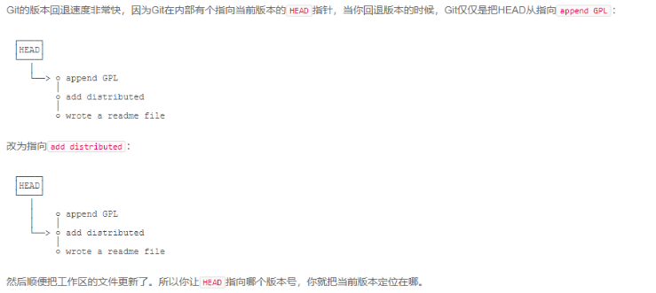
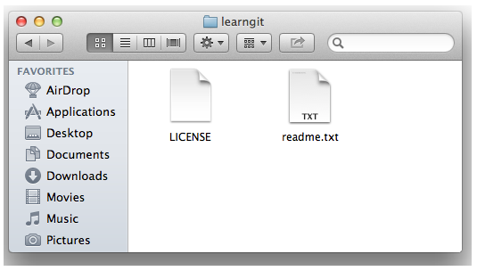

# Git 学习总结


> 特别声明：本文档内容总结自廖雪峰老师博客出品的Git教程，欢迎大家移步过去膜拜：
>
> <https://www.liaoxuefeng.com/wiki/896043488029600>

## 1. 集中式 VS 分布式

### 1.1 集中式

版本库是集中存放在中央服务器的，而干活的时候，用的都是自己的电脑，所以要先从中央服务器取得最新的版本，然后开始干活，干完活了，再把自己的活推送给中央服务器。中央服务器就好比是一个图书馆，你要改一本书，必须先从图书馆借出来，然后回到家自己改，改完了，再放回图书馆。典型的代表就是：**CVS** 和 **SVN**


### 1.2 分布式

布式版本控制系统根本没有 “中央服务器”，每个人的电脑上都是一个完整的版本库，这样，你工作的时候，就不需要联网了，因为版本库就在你自己的电脑上。既然每个人电脑上都有一个完整的版本库，那多个人如何协作呢？比方说你在自己电脑上改了文件 A，你的同事也在他的电脑上改了文件 A，这时，你们俩之间只需把各自的修改推送给对方，就可以互相看到对方的修改了。

> 在实际使用分布式版本控制系统的时候，其实很少在两人之间的电脑上推送版本库的修改，因为可能你们俩不在一个局域网内，两台电脑互相访问不了，也可能今天你的同事病了，他的电脑压根没有开机。因此，分布式版本控制系统通常也有一台充当 “中央服务器” 的电脑，但这个服务器的作用仅仅是用来方便 “交换” 大家的修改，没有它大家也一样干活，只是交换修改不方便而已。


### 1.3 分布式版本管理的优势

- **无需联网**

集中式版本控制系统最大的毛病就是必须联网才能工作，如果在局域网内还好，带宽够大，速度够快，可如果在互联网上，遇到网速慢的话，可能提交一个 10M 的文件就需要 5 分钟

- **安全性更高**

集中式版本控制系统依赖中央服务器，如果中央服务器宕机或者其他意外，那么将无法正常工作，并且会导致文件丢失。而分布式版本控制系统，只需要从其他人那里再复制一个即可。

- **分支管理**

Git中关于版本控制中的分支管理概念，是其他版本控制系统所没有的

- **免费**


##  2. Git 安装


### 2.1 在Linux上安装

最简便的方法，试着输入`git` ，看看系统有没有安装 Git，现在的 Linux 都会提示你是否安装，并且如何安装

```bash
$ git
The program 'git' is currently not installed. You can install it by typing:
sudo apt-get install git
```

### 2.2 在 Windows 上安装

1. 官网下载：<https://git-scm.com/downloads>
2. 傻瓜式安装
3. 安装过程中一定记得勾选安装 Git bash（一个能让你在Windows上使用Linux指令操作电脑的shell）


## 3. Git-本地操作 常用命令


### 3.1 全局配置

- 在本机上全局配置用户名

```bash
$ git config --global user.name "Your Name"
```

- 在本机上全局配置用户邮箱

```bash
$ git config --global user.email "email@example.com"
```

### 3.2 创建版本库并向版本库中添加文件

- 初始化版本库

> 版本库又名仓库，英文名**repository**，你可以简单理解成一个目录，这个目录里面的所有文件都可以被Git管理起来，每个文件的修改、删除，Git都能跟踪，以便任何时刻都可以追踪历史，或者在将来某个时刻可以“还原”。

```bash
$ git init
Initialized empty Git repository in F:/A-Python学习教程/Git使用文档/.git/
```

- 添加文件到版本库（可以同时add 多个文件）

```bash
$ git add README.md README1.md
```

- 提交文件更改

```bash
$ git commit -m <message>  # commit 命令会自动提交所有add到版本库中的文件
```

> 
>
> 简单解释一下`git commit`命令，`-m`后面输入的是本次提交的说明，可以输入任意内容，当然最好是有意义的，这样你就能从历史记录里方便地找到改动记录。
>
> 嫌麻烦不想输入`-m "xxx"`行不行？确实有办法可以这么干，但是强烈不建议你这么干，因为输入说明对自己对别人阅读都很重要。实在不想输入说明的童鞋请自行Google，我不告诉你这个参数。
>
> `git commit`命令执行成功后会告诉你，`1 file changed`：1个文件被改动（我们新添加的readme.txt文件）；`84 insertions`：插入了84行内容（readme.md有84行内容）。

### 3.3 文件修改后更新版本

- 查看当前版本库中的文件状态

```bash
$ git status
```

> 
>
> `git status`命令可以让我们时刻掌握仓库当前的状态，上面的命令 **modified** 输出告诉我们，`README.md`被修改过了，但还没有准备提交修改。

- 查看文件修改内容

```bash
$ git diff
```

> 
>
> `git diff`顾名思义就是查看difference，显示的格式正是Unix通用的diff格式，`---`表示相对于上一版本删除的内容，`+++`表示当前版本相比上一版本增加的内容，可以从上面的命令输出看到文件修改的内容。

- 提交新版本

提交修改和提交新文件是一样的两步：

1. 第一步是`git add`

```bash
$ git add readme.txt
```

2. 第二步是`git commit -m <说明内容>`


> 我们再来对比下，这些操作之间，如果我们查看版本库状态分别显示的内容：
>
> ###### 1. 文件改动后查看 `git status`
>
> 
>
> `git status`命令可以让我们时刻掌握仓库当前的状态，上面的命令 **modified** 输出告诉我们，`README.md`被修改过了，但还没有准备提交修改。
>
> ###### 2. 使用 `git add README.md` 和 `git commit -m '说明信息' ` 完成版本提交后
>
> 
>
> Git告诉我们当前没有需要提交的修改，而且，工作目录是干净（working tree clean）的。


### 3.4  版本回退

> 你不断对文件进行修改，然后不断提交修改到版本库里，就好比玩RPG游戏时，每通过一关就会自动把游戏状态存盘，如果某一关没过去，你还可以选择读取前一关的状态。有些时候，在打Boss之前，你会手动存盘，以便万一打Boss失败了，可以从最近的地方重新开始。Git也是一样，每当你觉得文件修改到一定程度的时候，就可以“保存一个快照”，这个快照在Git中被称为`commit`。一旦你把文件改乱了，或者误删了文件，还可以从最近的一个`commit`恢复，然后继续工作，而不是把几个月的工作成果全部丢失。

- 查看版本库提交记录

```bash
$ git log   # 由上到下为新版本--老版本 commit：版本号 author:作者 Date：提交日期 最后一行为我们在comit -m 指令后写的版本信息
```


如果我们需要精简显示版本日志：

```bash
$ git log --pretty=oneline  # 以单行精简模式显示
```


- 版本回退

`--hard` 参数的含义后面会说明

```bash
$ git reset --hard <版本号>
# 版本号的常用格式：
# 1. 回退一个版本：head^
# 2. 回退2个版本：head^^
# 3. 回退多个版本：head~100
# 4. 回退到具体某个版本：版本号 (版本号没必要写全，前几位就可以了，Git会自动去找)
```

> 注意：
>
> 一旦我们使用版本回退之后，这时候我们再去使用 `git log`命令查看版本记录，那么老版本之后的版本记录信息都将看不到。好比你从21世纪坐时光穿梭机来到了19世纪，想再回去已经回不去了，肿么办？那么如何回到21世纪呢，只需要找到21世纪对应的版本号，使用 `git reset --hard <版本号>` 命令还原回去即可

- 查看命令执行记录

在我们上面说到执行完版本回退后，假如我们再想回去，那么必须要知道我们退回到哪个版本号，那么就需要用到这个指令来查找我们要回去的版本号。

```bash
$ git reflog   # 用来记录你的每一次命令
```


- 小结一下：
  - `HEAD`指向的版本就是当前版本，因此，Git允许我们在版本的历史之间穿梭，使用命令`git reset --hard commit_id`。
  - 穿梭前，用`git log`可以查看提交历史，以便确定要回退到哪个版本。
  - 要重返未来，用`git reflog`查看命令历史，以便确定要回到未来的哪个版本。

> git版本变动非常迅速的原因：
>
> 


### 3.5 关于Git 工作区、暂存区、版本库的理解

> #### 工作区（Working Directory）:
>
> 就是你在电脑里能看到的目录，比如我的`learngit`文件夹就是一个工作区：
>
> 
>
> #### 版本库（Repository）
>
> 工作区有一个隐藏目录`.git`，这个不算工作区，而是Git的版本库。
>
> #### 暂存区（stage）
>
> Git的版本库里存了很多东西，其中最重要的就是称为stage（或者叫index）的暂存区，还有Git为我们自动创建的第一个分支`master`，以及指向`master`的一个指针叫`HEAD`。
>
> 
>
> 前面讲了我们把文件往Git版本库里添加的时候，是分两步执行的：
>
> 第一步是用`git add`把文件添加进去，实际上就是把文件修改添加到暂存区；
>
> 第二步是用`git commit`提交更改，实际上就是把暂存区的所有内容提交到当前分支。
>
> 因为我们创建Git版本库时，Git自动为我们创建了唯一一个`master`分支，所以，现在，`git commit`就是往`master`分支上提交更改。
>
> 你可以简单理解为，需要提交的文件修改通通放到暂存区，然后，一次性提交暂存区的所有修改。
>
> 所以，`git add`命令实际上就是把要提交的所有修改放到暂存区（Stage），然后，执行`git commit`就可以一次性把暂存区的所有修改提交到分支。
>
> **一个形象的比喻：**
>
> 我们使用 add 命令就像是在购物时，向购物车中添加商品，而commit 就好比是结账付款。每拿一件商品就需要付款未免太麻烦了吧？于是我们需要一个像购物车这样的 "暂存区" ，在添加好所有产品后，只需要提交一次即可。
>
> 查看原文章：<https://www.liaoxuefeng.com/wiki/896043488029600/897271968352576>

基于以上暂存区的知识：

```bash
$ git diff    #是工作区(work dict)和暂存区(stage)的比较
$ git diff --cached    #是暂存区(stage)和分支(master)的比较
```


### 3.6 撤销修改

- **场景1**：当你改乱了工作区某个文件的内容，但是没有执行`git add ` 命令，想直接丢弃工作区的修改时

```bash
$ git checkout -- readme.txt  # -- 符号很重要，没有这个 -- 指令含义不是撤销修改的意思了，而是变成了切换到另外一个分支的命令
```

> 命令`git checkout -- readme.txt`意思就是，把`readme.txt`文件在工作区的修改全部撤销，这里有两种情况：
>
> 一种是`readme.txt`自修改后还没有被放到暂存区，现在，撤销修改就回到和版本库一模一样的状态；
>
> 一种是`readme.txt`已经添加到暂存区后，又作了修改，现在，撤销修改就回到添加到暂存区后的状态。
>
> 总之，就是让这个文件回到最近一次`git commit` 或 `git add` 时的状态。

- **场景2**：当你不但改乱了工作区某个文件的内容，还添加到了暂存区时，想丢弃修改，分两步

1. 把暂存区的修改撤销掉（unstage），重新放回工作区

```bash
$ git reset HEAD readme.txt
# git reset命令既可以回退版本，也可以把暂存区的修改回退到工作区。当我们用HEAD时，表示最新的版本。
```

2. 丢弃工作区的修改

```bash
$ git checkout -- readme.txt
```

- **场景3**：已经提交了不合适的修改到版本库时，想要撤销本次提交，使用版本回退指令（前提是没有推送到远程库）

```bash
$ git reset --hard head^ # 回退到上一个版本
```


### 3.7 删除文件

- **场景1**：当你删除了工作区的某个文件的内容，但是这个文件从来没有被添加过暂存区。但是想要恢复文件。那么GG。

***这种情况下，是不能使用Git恢复删除文件的。***

- **场景2**：我们删除了一个文件，这个文件曾经被添加到过暂存区。而我们确实要删除这个文件。

  ```bash
  # 步骤1. 使用 rm 命令手动删除文件
  rm test.txt
  # 步骤2. 将改动更新至暂存区
  git rm test.txt
  # 或者使用 git add 命令也是同样效果的，因为都是将改动更新至暂存区
  git add test.txt
  # 步骤3：将暂存区同步至版本库
  git commit -m '删除test.txt文件'
  ```

- **场景3**：我们删除了一个文件，这个文件曾经被添加到过暂存区，但是我们是误删除，需要恢复。

```bash
# git checkout其实是用版本库里的版本替换工作区的版本，无论工作区是修改还是删除，都可以“一键还原”。
git checkout -- test.txt
```

> 命令`git rm`用于删除一个文件。如果一个文件已经被提交到版本库，那么你永远不用担心误删，但是要小心，你只能恢复文件到最新版本，你会丢失**最近一次提交后你修改的内容**。


## 4. Git 远程仓库 - 常用命令


### 4.1 使用 GitHub 作为远程仓库存储服务器 的 准备工作


#### 步骤1 ：创建 SSH Key

在用户主目录下，看看有没有. ssh 目录，如果有，再看看这个目录下有没有`id_rsa`和`id_rsa.pub`这两个文件，如果已经有了，可直接跳到下一步。如果没有，打开 Shell（Windows 下打开 Git Bash），创建 SSH Key：

```bash
$ ssh-keygen -t rsa -C "youremail@example.com"
```

#### 步骤2：登录GitHub账号(没有的话自行注册哦)，设置本机的 SSH Key 公钥


> 为什么 GitHub 需要 SSH Key 呢？因为 GitHub 需要识别出你推送的提交确实是你推送的，而不是别人冒充的，而 Git 支持 SSH 协议，所以，GitHub 只要知道了你的公钥，就可以确认只有你自己才能推送。
>
> 当然，GitHub 允许你添加多个 Key。假定你有若干电脑，你一会儿在公司提交，一会儿在家里提交，只要把每台电脑的 Key 都添加到 GitHub，就可以在每台电脑上往 GitHub 推送了。


### 4.2 将本地版本库推送到 GitHub 上(先有本地库，后有远程库)

当我们安装4.1 步骤在 GitHub 上创建一个新的 repository（版本库）后，会跳转到如下界面，界面中其实就已经告诉我们后续的操作步骤了：


#### 步骤1：在本地版本库目录中使用如下命令，将本地版本库与GitHub远程库关联

```bash
$ git remote add origin https://github.com/AmstrongSun/test.git
```

> 上述指令记得更换为你自己GitHub的版本库链接，远程库的名字就是`origin`，这是Git默认的叫法，也可以改成别的，但是`origin`这个名字一看就知道是远程库。

如果你本地的Git还没有登录过，可能会提示先登录，例如Windows版本中的登录界面如下：


#### 步骤2：首次将本地版本库所有内容推送到关联的远程库上

```bash
$ git push -u origin master
```

> 推送成功的提示如下：
>
> 
>
> 把本地库的内容推送到远程，用`git push`命令，实际上是把当前分支`master`推送到远程。
>
> 由于远程库是空的，我们第一次推送`master`分支时，加上了`-u`参数，Git不但会把本地的`master`分支内容推送的远程新的`master`分支，还会把本地的`master`分支和远程的`master`分支关联起来，在以后的推送或者拉取时就可以简化命令。

#### 步骤3：后续本地版本库推送到关联的远程库

只要本地作了提交，就可以通过以下命令将远程库与本地版本库同步

```bash
 # 无需再使用 -u 选项
$ git push origin master 
```

#### 小结：

> 要关联一个远程库，使用命令`git remote add origin git@server-name:path/repo-name.git`；
>
> 关联后，使用命令`git push -u origin master`第一次推送master分支的所有内容；
>
> 此后，每次本地提交后，只要有必要，就可以使用命令`git push origin master`推送最新修改；
>
> 分布式版本系统的最大好处之一是在本地工作完全不需要考虑远程库的存在，也就是有没有联网都可以正常工作，而SVN在没有联网的时候是拒绝干活的！当有网络的时候，再把本地提交推送一下就完成了同步，真是太方便了！


### 4.3 将远程库克隆到本地（先有远程库，后有本地库）

> 这种场景，会是我们项目开始时候的常规操作。一般项目经理，会在远程库中创建好项目目录，然后每个开发人员直接从远程库克隆一份至本地，然后开始自己的那份工作。


#### 步骤1：在 GitHub 中创建远程库 

这个步骤不再详细说明，参照上面新建远程库的步骤。

#### 步骤2：新建完成后左上角有远程库的 http 链接地址


#### 步骤3：在本地 Git bash 中使用 clone 命令完成项目的克隆

```bash
$ git clone git@github.com:shi-baoshun/shibaoshun.git
```

指令执行成功的返回如下：


> 注意：
>
> 你也许还注意到，GitHub给出的地址不止一个，还可以用`https://github.com/michaelliao/gitskills.git` 这样的地址。实际上，Git支持多种协议，默认的`git://` 使用ssh，但也可以使用`https`等其他协议。
>
> 使用`https`除了速度慢以外，还有个最大的麻烦是每次推送都必须输入口令，但是在某些只开放http端口的公司内部就无法使用`ssh`协议而只能用`https`。

## 5. Git 分支管理 - 常用命令

### 5.1 对分支的理解

形象的比喻：

> 分支就是科幻电影里面的平行宇宙，当你正在电脑前努力学习Git的时候，另一个你正在另一个平行宇宙里努力学习SVN。
>
> 如果两个平行宇宙互不干扰，那对现在的你也没啥影响。不过，在某个时间点，两个平行宇宙合并了，结果，你既学会了Git又学会了SVN！
>
> 

实际应用：

> 假设你准备开发一个新功能，但是需要两周才能完成，第一周你写了50%的代码，如果立刻提交，由于代码还没写完，不完整的代码库会导致别人不能干活了。如果等代码全部写完再一次提交，又存在丢失每天进度的巨大风险。
>
> 现在有了分支，就不用怕了。你创建了一个属于你自己的分支，别人看不到，还继续在原来的分支上正常工作，而你在自己的分支上干活，想提交就提交，直到开发完毕后，再一次性合并到原来的分支上，这样，既安全，又不影响别人工作。

### 5.2  分支管理常用指令

#### （1）查看分支

```bash
$ git branch   # 会列出所有分支，当前分支前面会标一个*号
```

#### （2）创建分支

```bash
$ git branch <name>
```

#### （3）切换分支

```bash
$ git checkout <name>
```

#### （4）创建并切换分支

```bash
$ git checkout -b <name>  # 相当于（2）+（3）
```

#### （5）合并某分支到当前分支

```bash
$ git checkout master  #一般都是合并到主分支master，所以一般都是先切换至主分支
$ git merge <name>  
```

#### （6）删除分支

```bash
$ git branch -d <name>
```

